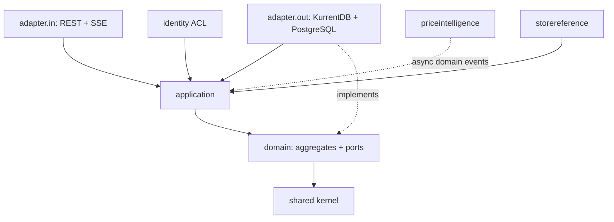
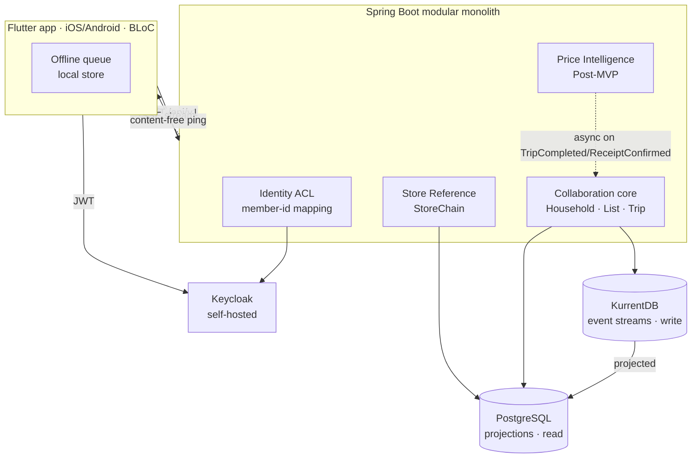
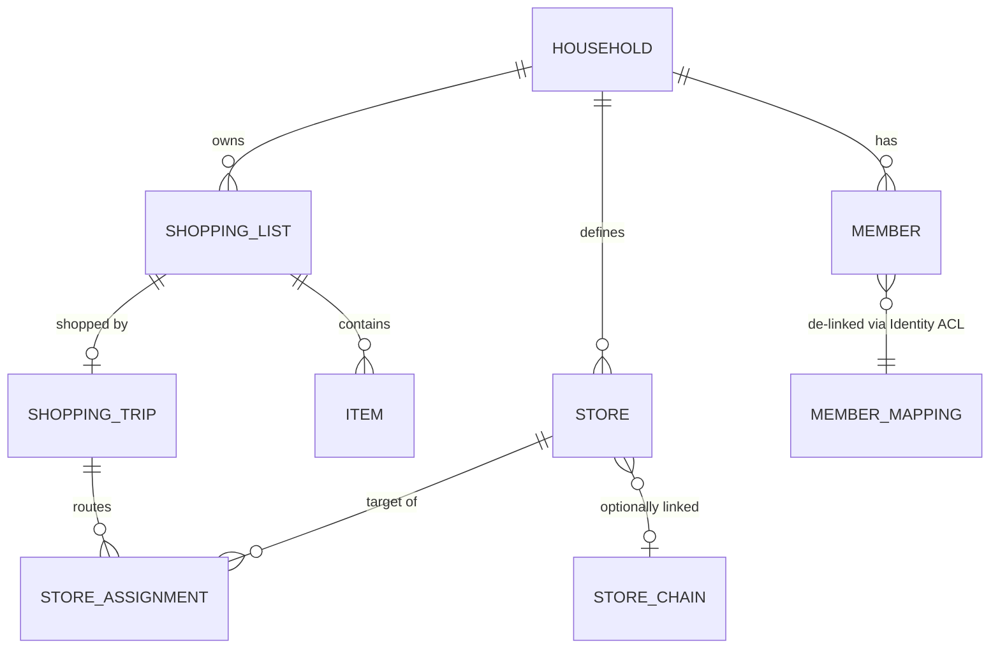

# Architecture Spine — SGART

## Design Paradigm

**Domain-Driven Design + CQRS + Event Sourcing, expressed hexagonally (ports & adapters), packaged as a modular monolith.**

- **Bounded contexts are code modules** in one Spring Boot deployable — never separate services (deliberate for a solo build at this scale).
- **The domain is pure.** No framework, persistence, transport, or identity type ever appears in domain code; infrastructure reaches the domain only through ports.
- **Write and read are separate.** Commands mutate aggregates and append events (KurrentDB); queries read PostgreSQL projections. The two never share a model.

Backend module layout (one root package per context, hexagonal layers inside each):

```text
de.sgart/
  collaboration/         # CORE context — the "one shared truth" + live differentiator
    domain/              #   aggregates, entities, value objects, domain events, ports (pure)
    application/         #   command handlers, query handlers, process managers
    adapter/
      in/                #     REST controllers, SSE endpoints  (drive the domain)
      out/               #     KurrentDB event store, PostgreSQL projectors (driven)
  storereference/        # SUPPORTING context — StoreChain reference data
  priceintelligence/     # CORE context, POST-MVP — Receipt, Product, price observations
  identity/              # GENERIC context — Keycloak Anti-Corruption Layer
  shared/                # shared kernel: Money, Quantity, ids, error model (no business logic)
```

Flutter client mirrors the split by feature, with BLoC per screen; SSE domain/read events map to BLoC events.

## Invariants & Rules

Dependency direction (a module may depend only in the arrow's direction; the domain depends on nothing):



### AD-1 — Paradigm is fixed: DDD + CQRS + Event Sourcing, hexagonal

- **Binds:** all backend code.
- **Prevents:** business rules leaking into controllers/persistence; read and write concerns entangling; a second source of truth.
- **Rule:** Every state change is a command handled by an aggregate that emits domain events. Domain code imports no framework/infrastructure/transport type; infrastructure is reached only through ports (interfaces owned by the domain). `[ADOPTED]`

### AD-2 — Modular monolith; contexts are modules, not services

- **Binds:** whole system structure.
- **Prevents:** premature microservice coordination cost; two owners of one entity across modules.
- **Rule:** Four contexts — **Collaboration** (core), **Store Reference** (supporting), **Price Intelligence** (core, Post-MVP), **Identity** (generic) — are packages in one deployable. A context may only touch another through its published application-layer port or an async domain event; never by reaching into another context's domain or database tables. `[ADOPTED]`

### AD-3 — Household + Shopping stay one context for MVP

- **Binds:** Collaboration context.
- **Prevents:** boundary/coordination overhead an MVP doesn't need.
- **Rule:** `Household`, `ShoppingList`, `ShoppingTrip` live in one context as distinct aggregates. They reference each other only by id, never by object graph. A split is a future decision, not assumed now. `[ADOPTED]`

### AD-4 — Single source of truth: command → aggregate → event, with optimistic concurrency

- **Binds:** all backend writes and reads.
- **Prevents:** direct read-model mutation; two write paths; lost updates.
- **Rule:** State changes only by appending events to KurrentDB under an **expected-version** check. Read models (PostgreSQL) are built by projectors subscribed to the event streams and are **never written directly** by command handlers. Projections are eventually consistent; UI and clients must tolerate that.

### AD-5 — People are referenced only by a household-scoped pseudonym

- **Binds:** every aggregate, event, and read model that references a person.
- **Prevents:** PII (Keycloak id, email, name) in the immutable log; cross-household correlation of a person.
- **Rule:** Domain events carry a per-membership **`MemberId`** (opaque, unique within a household) — never `keycloakUserId`, email, or display name. The **Identity ACL is the sole minter** of a `MemberId`: it creates the id when a member first joins (invite acceptance), writes the mapping, and the Household's `MemberJoined` event then carries that same id — no other component generates one. The ACL owns the sole mutable mapping `{householdId, memberId → keycloakUserId}` and resolves `(keycloakUserId, householdId) → memberId` on each request. A person in two households has two unrelated `MemberId`s.

### AD-6 — No persisted PII; identity display data is read live from Keycloak

- **Binds:** all read models, UI, API responses.
- **Prevents:** stale PII copies that each need separate erasure.
- **Rule:** SGART never persists display name or email. They are resolved on demand from Keycloak/JWT claims for display only. Invite email never enters an event: `MemberInvited` carries `inviteId` + `HMAC(secret, normalizedEmail)` (for the no-duplicate-pending-invite invariant). The HMAC secret is a **stable per-deployment server secret** (never a per-invite random salt) — otherwise two invites to the same address would hash differently and the duplicate check would silently fail. The raw email lives only in a mutable invite side-store, purged on accept, expiry, or erasure; delivery is Keycloak's.

### AD-7 — Right-to-erasure by de-linking, never by rewriting history

- **Binds:** erasure workflow across all contexts.
- **Prevents:** event-history rewriting; non-compliant retention of personal data.
- **Rule:** Erasure = destroy the person's Identity-ACL mapping rows + scrub PostgreSQL read models + purge device/offline caches + delete the Keycloak account. The event log is **never** rewritten; residual orphaned `MemberId`s are unlinkable and thus anonymized (GDPR Recital 26). Any content that is itself PII inside an event/blob (Post-MVP receipt images / OCR text) must instead use **crypto-shredding** — a per-subject data key in a vault, destroyed on erasure. Reserved, not built for MVP.

### AD-8 — Offline queue rides the same concurrency mechanism

- **Binds:** offline sync and every command handler.
- **Prevents:** silent last-writer-wins; double-apply on retry; unbounded merge complexity.
- **Rule:** Each queued command carries the **version of the target aggregate root's stream** it was based on (the concurrency token is always that one root's stream version — never a related aggregate's) and a **client command-id**. On replay: a stale expected-version is *rejected*, and the client surfaces a **coarse keep/discard** prompt (FR-26) — no auto-merge, no field-level reconciliation; convergent/idempotent actions resolve silently. The command-id makes replay idempotent (a retry never double-applies).

### AD-9 — Money and Quantity are value objects, never primitives

- **Binds:** all money and quantity handling across contexts.
- **Prevents:** floating-point money bugs; unanalysable free-text units.
- **Rule:** `Money` = integer **minor units (cents) + ISO currency code** (MVP EUR-only, but currency is explicit); arithmetic never uses floating point. `Quantity` = amount + `Unit` drawn from a **controlled, extensible vocabulary** (piece, gram, kilogram, millilitre, litre, pack, …) — free-text units are rejected.

### AD-10 — Aggregate boundaries own their internal entities

- **Binds:** Collaboration aggregate design.
- **Prevents:** two owners of one entity; cross-aggregate direct mutation.
- **Rule:** `Item` is an entity inside the `ShoppingList` aggregate; `Store` is an entity inside `Household`. Neither is loaded, referenced, or mutated from outside its aggregate root — only the root accepts commands. Cross-aggregate effects go through **process managers** issuing new commands (e.g. `ItemPostponed{targetListId}` → add-item on the target list). A process-manager-issued command is **idempotent**: its command-id is derived deterministically from the triggering event's id, so re-processing an event on projection/subscription replay never double-applies (AD-8's idempotency rule covers both client- and process-manager-originated commands).

### AD-11 — Domain vocabulary is spelled out and unambiguous

- **Binds:** all code, events, tests, API (enforces CLAUDE.md §2–§3).
- **Prevents:** one term meaning two things; abbreviations that obscure intent.
- **Rule:** Entity `Member` = a person's participation in a household; the role is `HouseholdRole { Admin, Participant }` (never the bare word "Member" for the role). No abbreviations in names (`quantity`, not `qty`); established acronyms (OCR, SSE, JWT, id) are the only exception. The PRD §3 glossary is the ubiquitous language; the same concept has the same name in domain, events, read models, API, and UI.

## Consistency Conventions

| Concern | Convention |
| --- | --- |
| Naming — entities/VOs | PascalCase, full words, from the PRD glossary. `Member`, `ShoppingList`, `StoreAssignment`, `Money`. No abbreviations (AD-11). |
| Naming — domain events | Past tense, PascalCase: `ItemAdded`, `TripCompleted`. One aggregate emits them; stream key `household-{id}` / `list-{id}` / `trip-{id}`. |
| Naming — commands | Imperative: `AddItem`, `StartTrip`. Carry `basedOnVersion` + `commandId` when client-originated (AD-8). |
| Identity in payloads | `MemberId` only (AD-5). Never `keycloakUserId`/email/name in events or read models. |
| Ids | Opaque server-generated (UUID); `keycloakUserId` never in request body/path — taken from the JWT `sub`. |
| Money / quantity | `Money{amountMinor:int, currency}`; `Quantity{amount, unit}` controlled vocab (AD-9). |
| Dates & formatting | Store UTC ISO-8601; format per user `Locale` client-side (de-DE → "1,09 €", comma decimal). No locale-formatted values persisted. |
| Error shape | `{ code, message, details }`. `code` = client-facing machine key → localized copy client-side; `message` = log/debug only, never shown to users. |
| Localization | No hard-coded user-facing strings; all via localization layer keyed by `Locale` (per-user, device-default → override → `de-DE` fallback). MVP ships German. |
| State mutation | Only via command → aggregate → event under expected-version (AD-4). Read models are projection-only. |
| Auth | JWT from Keycloak validated at `adapter.in`; ACL resolves `MemberId` before the domain is touched (AD-5). |
| Transport | REST under `/api/v1`; SSE per-household stream for live sync. No pagination in MVP. |
| Testing | Per CLAUDE.md §6: domain covered by fast unit tests with no infrastructure; commands tested for events, queries for read models; synthetic data only; erasure/export/retention have explicit tests. |

## Stack

Seed — web-verified current at 2026-08-20; the code owns these once it exists.

| Name | Version |
| --- | --- |
| Java | 25 (LTS) |
| Spring Boot | 4.1.0 |
| Flutter / Dart | Flutter 3.44 (stable) |
| Keycloak | 26.7.0 (no LTS — track newest) |
| KurrentDB (formerly EventStoreDB) — write model | 25.x (confirm current LTS line at build) |
| PostgreSQL — read model | 18.6 |
| Real-time transport | Server-Sent Events (SSE) |
| Client state management | BLoC |
| OCR (Post-MVP) | ML Kit on-device, behind a Strategy port |
| Deployment | Docker Compose on a dedicated German/EU server (e.g. Hetzner/IONOS) |

## Structural Seed

Context / container view:



Core-entity relationships (names + relationships only; attribute-level invariants are ADs, not this diagram):



## Capability → Architecture Map

| Capability / Area | Lives in | Governed by |
| --- | --- | --- |
| Households, membership, roles, invites (FR-1–FR-3) | Collaboration · `Household` | AD-3, AD-5, AD-6, AD-11 |
| Stores + client-side chain match (FR-4–FR-5) | Collaboration · `Household`; Store Reference | AD-2, AD-10 |
| Lists, items, status, autocomplete (FR-6–FR-8, FR-27) | Collaboration · `ShoppingList` | AD-4, AD-9, AD-10 |
| Live sync + offline queue + conflict surfacing (FR-10, FR-11, FR-26) | Collaboration; client offline queue | AD-4, AD-8 |
| Trips: start, route, in-trip actions, completion (FR-12–FR-14, FR-16) | Collaboration · `ShoppingTrip` | AD-4, AD-10 |
| Print & share (FR-17–FR-18) | Client | Convention (grouped-by-store layout) |
| Content-free notifications (FR-19) | Backend + client | AD-5 (no data in payload) |
| Localization (FR-24–FR-25) | Client + Keycloak email templates | Conventions (localization, dates) |
| Erasure / data protection (CLAUDE.md §5) | Identity ACL + all contexts | AD-5, AD-6, AD-7 |
| Receipts, price history, routing (FR-20–FR-23) | Price Intelligence (Post-MVP) | AD-2, AD-7 (crypto-shred), AD-9 |

## Deferred

- **Post-MVP contexts built later:** Price Intelligence (Receipt, Product, price observations, routing, dashboard) — reserved in the module layout, integrated only via async events; not built for MVP.
- **Trip lifecycle is permanently `Active → Done`.** Pause/resume is **dropped**, not reserved — cross-day or unfinished shopping is handled by completing the trip and transferring leftover items to the next list (FR-16). No `Paused` state, and no "at most one Active-*or-Paused*" variant, ever enters the model. (Overrides PRD FR-15, which still lists it as backlog.)
- **Reserved-not-built events:** `NotificationSettingsUpdated` (MVP ships fixed default notifications), list duplicate/template (FR-9 fast-follow).
- **Crypto-shredding implementation** — the pattern is fixed (AD-7); the key-vault mechanics are settled when Price Intelligence is built.
- **KurrentDB LTS line** — pin the exact current LTS at build; seed says 25.x.
- **Concretization backlog (build-time detail, owned by code):** PostgreSQL projection schemas incl. the FR-27 autocomplete read model; SSE event JSON format + reconnect/auth; Flutter screen map & navigation; Keycloak realm/client config + invite deep-link/web-fallback flow; offline local store (SQLite/Hive) + expected-version capture/refresh; Docker Compose service topology, volumes, dev-vs-prod config.
- **Geolocation store discovery (FR-28)** — gated on a privacy-friendly geodata source (self-hosted OSM/Overpass/Nominatim); backlog.
- **Public-phase concerns:** self-hosted push (UnifiedPush) vs. FCM/APNs, full web client, multi-market StoreChain sourcing, additional UI languages.
